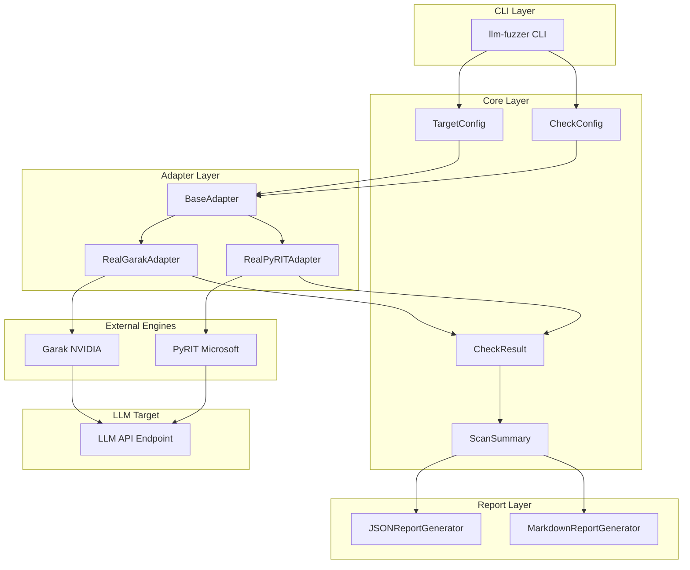
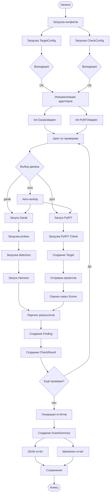

# Architecture Decision Record: LLM Fuzzer

## Структура документа

Документ будет создан в файле `docs/ADR.md` и будет содержать следующие разделы:

---

### 1. Введение и мотивация

**Проблема:** Необходимость унифицированного инструмента для тестирования безопасности LLM, объединяющего возможности различных фреймворков.

**Решение:** LLM Fuzzer - интерфейс-обёртка над Garak (NVIDIA) и PyRIT (Microsoft).

**Преимущества:**

- Единый интерфейс для двух мощных фреймворков
- Унифицированные отчёты с полной информацией
- Декларативные YAML конфигурации
- CLI для автоматизации в CI/CD
- Расширяемость через плагины

---

### 2. Архитектурная диаграмма



---

### 3. Блок-схема процесса сканирования



---

### 4. Структура данных

**Ключевые модели из [`src/llm_fuzzer/core/`](src/llm_fuzzer/core/):**

| Модель | Файл | Назначение |

|--------|------|------------|

| `TargetConfig` | `target.py` | Конфигурация целевого LLM endpoint |

| `CheckConfig` | `check.py` | Конфигурация проверки безопасности |

| `CheckResult` | `check.py` | Результат выполнения проверки |

| `Finding` | `check.py` | Отдельная найденная уязвимость |

| `ScanSummary` | `report.py` | Сводка результатов сканирования |

---

### 5. Категории проверок

Таблица категорий из `CheckCategory`:

| Категория | Описание | Движок |

|-----------|----------|--------|

| `jailbreak` | Обход ограничений (DAN, roleplay) | Garak |

| `injection` | Prompt injection атаки | Garak |

| `leakage` | Утечка system prompt | PyRIT |

| `tool_abuse` | Злоупотребление tool calls | PyRIT |

| `toxicity` | Генерация токсичного контента | Garak |

| `hallucination` | Галлюцинации модели | Garak |

| `bias` | Предвзятость модели | Garak |

---

### 6. Конфигурации

Примеры YAML конфигов из [`configs/`](configs/):

**Target конфигурация:**

```yaml
name: my-target
endpoint: https://api.example.com/v1
api_key: ${API_KEY}
model: gpt-4
type: openai
options:
  disable_ssl_verify: false
  timeout: 60
```

**Check конфигурация:**

```yaml
checks:
  - id: jailbreak-dan
    name: DAN Jailbreak
    category: jailbreak
    engine: garak
    severity: high
    garak_probes:
      - dan.Dan_11_0
    garak_detectors:
      - mitigation.MitigationBypass
    max_prompts: 10
    generations: 1
```

---

### 7. Структура отчётов

**JSON отчёт:**

```json
{
  "meta": { "version": "1.0", "generator": "llm-fuzzer" },
  "target": { "name", "endpoint", "model" },
  "summary": {
    "total_checks", "passed", "failed",
    "findings_by_severity": { "critical", "high", "medium", "low" }
  },
  "results": [
    {
      "check_id", "status", "severity",
      "total_prompts", "successful_attacks", "success_rate",
      "findings": [
        { "prompt", "response", "evidence", "confidence" }
      ]
    }
  ]
}
```

---

### 8. Расширяемость

**Добавление PyRIT проверки:**

```python
@register_check("my-custom-check")
class MyCustomCheck(BasePyRITCheck):
    name = "My Custom Check"
    category = CheckCategory.CUSTOM
    
    async def run(self, target, config):
        # Логика проверки
        return [PyRITCheckResult(...)]
```

---

## Файл для создания

Создать файл `docs/ADR.md` с полным содержимым документа, включающим:

- Все диаграммы в формате Mermaid
- Таблицы с категориями проверок
- Примеры конфигураций
- Структуры данных
- Инструкции по расширению