# Основы больших языковых моделей (LLM): техническое руководство

## Оглавление

1. [Введение](#введение)
2. [Нейронные сети: от классического ML к глубокому обучению](#нейронные-сети-от-классического-ml-к-глубокому-обучению)
   - [Отличия от классического ML](#отличия-от-классического-ml)
   - [Архитектура нейронной сети](#архитектура-нейронной-сети)
   - [Специализированные архитектуры](#специализированные-архитектуры)
3. [Большие языковые модели (LLM)](#большие-языковые-модели-llm)
   - [Что такое LLM](#что-такое-llm)
   - [Архитектура Transformer](#архитектура-transformer)
   - [Обучение LLM](#обучение-llm)
4. [Инференс (Inference)](#инференс-inference)
   - [Что такое инференс](#что-такое-инференс)
   - [Процесс генерации текста](#процесс-генерации-текста)
   - [Оптимизация инференса](#оптимизация-инференса)
5. [Сервинг (Serving) LLM](#сервинг-serving-llm)
   - [Развертывание моделей](#развертывание-моделей)
   - [Инфраструктура сервинга](#инфраструктура-сервинга)
   - [Инструменты и фреймворки](#инструменты-и-фреймворки)
6. [RAG (Retrieval-Augmented Generation)](#rag-retrieval-augmented-generation)
   - [Что такое RAG](#что-такое-rag)
   - [Компоненты RAG](#компоненты-rag)
   - [Типы RAG](#типы-rag)
7. [LLM Агенты](#llm-агенты)
   - [Что такое агенты](#что-такое-агенты)
   - [Архитектура агентов](#архитектура-агентов)
   - [Типы агентов](#типы-агентов)
   - [Инструменты и фреймворки](#инструменты-и-фреймворки-1)
8. [Практические примеры](#практические-примеры)
9. [Заключение](#заключение)

---

## Введение

Большие языковые модели (Large Language Models, LLM) представляют собой один из наиболее значимых прорывов в области искусственного интеллекта за последние годы. Эти модели способны понимать и генерировать человеческий язык с беспрецедентной точностью, открывая новые возможности для создания интеллектуальных систем.

Данное руководство предназначено для специалистов, знакомых с классическим машинным обучением (градиентный спуск, бустинг, деревья решений), и стремится объяснить фундаментальные концепции нейронных сетей, архитектуру LLM, процессы инференса и сервинга, а также современные подходы к построению интеллектуальных систем на основе LLM, такие как RAG и агенты.

Мы начнем с изучения нейронных сетей и их отличий от классических методов машинного обучения, затем перейдем к архитектуре Transformer, лежащей в основе современных LLM, и завершим рассмотрением практических аспектов развертывания и использования этих моделей в реальных приложениях.

---

## Нейронные сети: от классического ML к глубокому обучению

### Отличия от классического ML

Если вы знакомы с классическим машинным обучением, вы знаете, что такие алгоритмы, как градиентный бустинг (XGBoost, LightGBM) или случайный лес, работают с предварительно извлеченными признаками (features). Нейронные сети кардинально отличаются тем, что они **автоматически извлекают признаки** из сырых данных в процессе обучения.

#### Параметрические vs непараметрические модели

В классическом ML мы часто имеем дело с:
- **Непараметрическими моделями**: количество параметров растет с размером данных (например, k-NN, где хранятся все примеры)
- **Параметрическими моделями**: фиксированное количество параметров (например, линейная регрессия с весами w₁, w₂, ..., wₙ)

Нейронные сети — это **параметрические модели**, но с очень большим количеством параметров (миллионы или миллиарды). Ключевое отличие: эти параметры организованы в иерархическую структуру слоев, где каждый слой учится извлекать все более абстрактные признаки.

#### Градиентный спуск в нейросетях (Backpropagation)

Вы знакомы с градиентным спуском для оптимизации функции потерь. В нейросетях используется тот же принцип, но с важным дополнением — **алгоритмом обратного распространения ошибки (backpropagation)**.

**Прямой проход (Forward Pass)**:
```
x → Layer 1 → Layer 2 → ... → Layer L → ŷ
```

**Обратный проход (Backward Pass)**:
Градиенты вычисляются от выходного слоя к входному, используя цепное правило дифференцирования:

$$\frac{\partial L}{\partial w_{ij}^{(l)}} = \frac{\partial L}{\partial z_j^{(l+1)}} \cdot \frac{\partial z_j^{(l+1)}}{\partial w_{ij}^{(l)}}$$

где:
- $L$ — функция потерь
- $w_{ij}^{(l)}$ — вес между нейроном $i$ слоя $l$ и нейроном $j$ слоя $l+1$
- $z_j^{(l+1)}$ — активация нейрона $j$ в слое $l+1$

**Ключевое отличие от классического ML**: В классическом градиентном бустинге мы оптимизируем ансамбль простых моделей (деревьев). В нейросетях мы оптимизируем единую сложную функцию, состоящую из множества нелинейных преобразований.

#### Автоматическое извлечение признаков

В классическом ML вы вручную создаете признаки:
```python
# Классический подход
features = [
    'age',
    'income',
    'age * income',  # ручное создание взаимодействий
    'log(income)',
    # ... и т.д.
]
```

В нейросетях признаки извлекаются автоматически:
```python
# Нейросеть автоматически учится
raw_input → Layer 1 (простые признаки) → Layer 2 (сложные признаки) → ... → output
```

Каждый слой учится комбинировать признаки предыдущего слоя, создавая все более абстрактные представления.

### Архитектура нейронной сети

#### Перцептрон и многослойный перцептрон (MLP)

**Однослойный перцептрон** — это базовая единица нейросети:

$$y = f(\sum_{i=1}^{n} w_i x_i + b)$$

где:
- $x_i$ — входные признаки
- $w_i$ — веса
- $b$ — смещение (bias)
- $f$ — функция активации

**Многослойный перцептрон (MLP)** состоит из нескольких слоев:

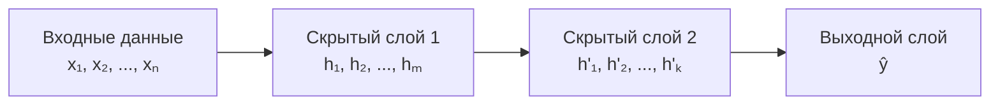

Математически, для слоя $l$:

$$h^{(l)} = f^{(l)}(W^{(l)} h^{(l-1)} + b^{(l)})$$

где $W^{(l)}$ — матрица весов слоя $l$.

#### Функции активации

Функции активации вводят нелинейность, что критично для обучения сложных паттернов:

**1. Sigmoid**: $\sigma(x) = \frac{1}{1 + e^{-x}}$
- Диапазон: (0, 1)
- Используется в выходном слое для бинарной классификации
- Проблема: насыщение (vanishing gradient) при больших значениях

**2. Tanh**: $\tanh(x) = \frac{e^x - e^{-x}}{e^x + e^{-x}}$
- Диапазон: (-1, 1)
- Центрированная версия sigmoid
- Также страдает от vanishing gradient

**3. ReLU (Rectified Linear Unit)**: $ReLU(x) = \max(0, x)$
- Наиболее популярная функция активации
- Решает проблему vanishing gradient для положительных значений
- Проблема: "мертвые нейроны" (dying ReLU) при отрицательных значениях

**4. GELU (Gaussian Error Linear Unit)**: $GELU(x) = x \cdot \Phi(x)$
- Используется в Transformer моделях (BERT, GPT)
- Гладкая аппроксимация ReLU

#### Потеря и оптимизация

**Функции потерь**:
- **Кросс-энтропия** (для классификации): $L = -\sum_{i} y_i \log(\hat{y}_i)$
- **MSE** (для регрессии): $L = \frac{1}{n}\sum_{i}(y_i - \hat{y}_i)^2$

**Оптимизаторы** (расширения градиентного спуска):

1. **SGD (Stochastic Gradient Descent)**: $w_{t+1} = w_t - \eta \nabla L(w_t)$
2. **Adam** (Adaptive Moment Estimation): адаптивные learning rates для каждого параметра
3. **AdamW**: Adam с правильным weight decay

### Специализированные архитектуры

#### CNN (Сверточные нейронные сети)

CNN используют **сверточные слои** для обработки структурированных данных (изображения, временные ряды):

**Ключевые компоненты**:
- **Convolutional layer**: применяет фильтры (kernels) для обнаружения паттернов
- **Pooling layer**: уменьшает размерность (max pooling, average pooling)
- **Fully connected layer**: финальная классификация

**Свертка**: $y[i, j] = \sum_{m} \sum_{n} x[i+m, j+n] \cdot w[m, n]$

#### RNN/LSTM (Рекуррентные нейронные сети)

RNN обрабатывают последовательности, сохраняя состояние:

$$h_t = f(W_h h_{t-1} + W_x x_t + b)$$

**Проблема RNN**: vanishing gradient при длинных последовательностях.

**LSTM (Long Short-Term Memory)** решает эту проблему через механизм "ворот" (gates):
- **Forget gate**: что забыть из предыдущего состояния
- **Input gate**: что добавить в состояние
- **Output gate**: что вывести

#### Transformer (основа современных LLM)

Transformer — революционная архитектура, которая заменила RNN/LSTM для обработки последовательностей. Ключевое отличие: **параллельная обработка** всей последовательности через механизм **attention**.

**Основные компоненты**:
1. **Self-Attention**: позволяет каждому элементу последовательности "обращать внимание" на все остальные
2. **Positional Encoding**: добавляет информацию о позиции (так как нет рекуррентности)
3. **Feed-Forward Networks**: применяются независимо к каждому элементу

Transformer будет детально рассмотрен в следующем разделе, так как он лежит в основе всех современных LLM.

---

## Большие языковые модели (LLM)

### Что такое LLM

**Большая языковая модель (Large Language Model, LLM)** — это нейронная сеть с миллиардами параметров, обученная на огромных корпусах текстовых данных для понимания и генерации человеческого языка.

#### Определение и характеристики

**Ключевые характеристики LLM**:
- **Масштаб**: от сотен миллионов до триллионов параметров
- **Архитектура**: основана на Transformer
- **Обучение**: самообучение (self-supervised learning) на неразмеченных текстах
- **Универсальность**: способность решать множество задач без переобучения (few-shot, zero-shot learning)

**Параметры vs данные**:
- GPT-3: 175 миллиардов параметров, обучен на ~500 миллиардах токенов
- GPT-4: предположительно >1 триллион параметров
- LLaMA 2: до 70 миллиардов параметров

#### Эволюция: от n-gram к Transformer

**1. N-gram модели (статистические)**:
- Вероятность следующего слова: $P(w_n | w_{n-1}, w_{n-2}, ..., w_{n-k})$
- Ограничение: не могут улавливать дальние зависимости

**2. Нейронные языковые модели (RNN/LSTM)**:
- Обработка последовательностей
- Проблема: медленное обучение, vanishing gradient

**3. Transformer (2017)**:
- Параллельная обработка, attention механизм
- Прорыв: BERT (2018), GPT-2 (2019), GPT-3 (2020)

**4. Современные LLM (2020-2024)**:
- Масштабирование: больше параметров, больше данных
- Инструктивное обучение: ChatGPT, Claude
- Мультимодальность: GPT-4V, Gemini

#### Современные модели

**Decoder-only (авторегрессионные)**:
- **GPT-3/GPT-4** (OpenAI): генерация текста
- **LLaMA** (Meta): открытая модель
- **PaLM** (Google): Pathways Language Model

**Encoder-only**:
- **BERT** (Google): понимание текста, классификация

**Encoder-Decoder**:
- **T5** (Google): универсальная модель для всех NLP задач
- **BART** (Facebook): генерация и понимание

### Архитектура Transformer

Transformer был представлен в статье "Attention is All You Need" (Vaswani et al., 2017) и стал основой всех современных LLM.

#### Self-Attention механизм

**Attention** позволяет модели "обращать внимание" на разные части входной последовательности при обработке каждого элемента.

**Математика Self-Attention**:

Для входной последовательности $X = [x_1, x_2, ..., x_n]$:

1. **Query, Key, Value**:
   $$Q = XW_Q, \quad K = XW_K, \quad V = XW_V$$

2. **Attention scores**:
   $$\text{Attention}(Q, K, V) = \text{softmax}\left(\frac{QK^T}{\sqrt{d_k}}\right)V$$

где $d_k$ — размерность ключей (для стабилизации градиентов).

**Интуиция**:
- **Query**: "что я ищу?"
- **Key**: "что я представляю?"
- **Value**: "какую информацию я несу?"

Каждый элемент последовательности может "спросить" у всех остальных элементов информацию через attention scores.

**Пример**:
```
"Кот сидит на коврике"
При обработке слова "сидит", модель может обратить внимание на:
- "Кот" (кто сидит?) — высокий attention score
- "коврике" (где сидит?) — высокий attention score
- "на" (предлог) — средний attention score
```

#### Multi-Head Attention

Вместо одного attention механизма, используется несколько параллельных "голов":

$$\text{MultiHead}(Q, K, V) = \text{Concat}(\text{head}_1, ..., \text{head}_h)W^O$$

где каждая голова:
$$\text{head}_i = \text{Attention}(QW_i^Q, KW_i^K, VW_i^V)$$

**Преимущества**:
- Разные головы учатся обращать внимание на разные типы зависимостей
- Одна голова может фокусироваться на синтаксисе, другая — на семантике

**Архитектура Multi-Head Attention**:

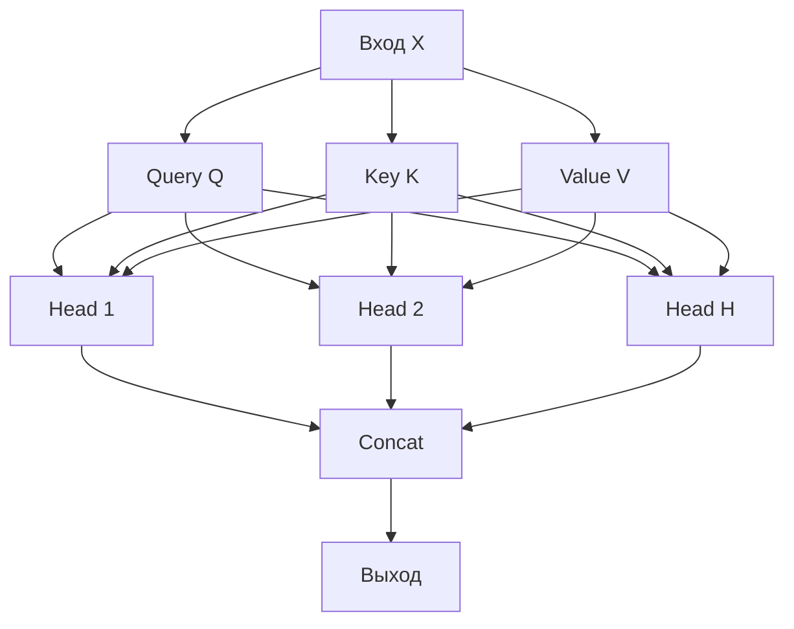

#### Positional Encoding

Поскольку Transformer не имеет рекуррентности или свертки, он не имеет встроенного представления о порядке элементов. **Positional encoding** добавляет информацию о позиции:

$$PE_{(pos, 2i)} = \sin\left(\frac{pos}{10000^{2i/d_{model}}}\right)$$

$$PE_{(pos, 2i+1)} = \cos\left(\frac{pos}{10000^{2i/d_{model}}}\right)$$

где:
- $pos$ — позиция в последовательности
- $i$ — размерность
- $d_{model}$ — размерность модели

Эти синусоидальные функции позволяют модели понимать относительные позиции.

#### Encoder-Decoder vs Decoder-Only архитектуры

**Encoder-Decoder** (BERT, T5):
- **Encoder**: двунаправленный, видит всю последовательность
- **Decoder**: односторонний, генерирует последовательно
- Используется для задач перевода, summarization

**Decoder-Only** (GPT, LLaMA):
- Только decoder блоки
- Авторегрессионная генерация: каждое слово зависит от предыдущих
- Используется для генерации текста

**Архитектура Decoder-Only Transformer**:

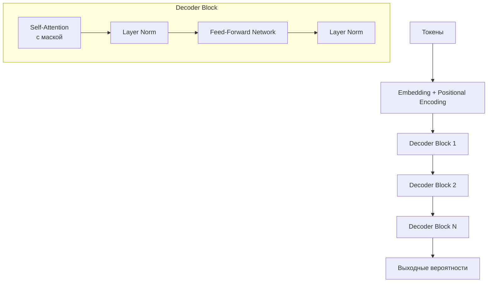

**Masked Self-Attention**: В decoder-only архитектуре используется маска, чтобы предотвратить "подглядывание" в будущие токены при генерации.

### Обучение LLM

#### Pre-training (самообучение)

**Цель**: научить модель понимать язык на больших неразмеченных корпусах текста.

**Задачи предобучения**:

**1. Language Modeling (авторегрессионное)**:
- Предсказание следующего слова: $P(w_t | w_{t-1}, ..., w_1)$
- Используется в GPT моделях
- Loss: кросс-энтропия

**2. Masked Language Modeling (MLM)**:
- Маскирование случайных токенов и их предсказание
- Используется в BERT
- Пример: "Кот [MASK] на коврике" → предсказать "сидит"

**3. Next Sentence Prediction (NSP)**:
- Предсказание, является ли предложение B следующим за предложением A
- Используется в BERT

**Данные для предобучения**:
- Common Crawl: веб-страницы
- Wikipedia
- Книги (Project Gutenberg)
- Код (GitHub)

#### Fine-tuning (дообучение)

После предобучения модель дообучается на конкретных задачах.

**Supervised Fine-Tuning (SFT)**:
- Обучение на размеченных данных для конкретной задачи
- Примеры: классификация, question answering, summarization
- Обычно требуется меньше эпох и меньший learning rate

**Instruction Tuning**:
- Обучение следовать инструкциям
- Формат: инструкция → ответ
- Пример: "Переведи на английский: Привет" → "Hello"

#### Reinforcement Learning from Human Feedback (RLHF)

RLHF используется для выравнивания модели с человеческими предпочтениями.

**Этапы RLHF**:

1. **Supervised Fine-Tuning**: базовая модель обучается на примерах диалогов
2. **Reward Model Training**: обучение модели вознаграждения на человеческих предпочтениях
3. **RL Optimization**: оптимизация политики через PPO (Proximal Policy Optimization)

**Математика PPO**:

Цель: максимизировать ожидаемое вознаграждение:
$$L^{CLIP}(\theta) = \mathbb{E}_t[\min(r_t(\theta)\hat{A}_t, \text{clip}(r_t(\theta), 1-\epsilon, 1+\epsilon)\hat{A}_t)]$$

где:
- $r_t(\theta) = \frac{\pi_\theta(a_t|s_t)}{\pi_{\theta_{old}}(a_t|s_t)}$ — отношение вероятностей
- $\hat{A}_t$ — оценка преимущества
- $\epsilon$ — гиперпараметр для ограничения изменения политики

#### Параметры обучения

**Learning Rate**:
- Pre-training: обычно $10^{-4}$ - $10^{-3}$
- Fine-tuning: обычно $10^{-5}$ - $10^{-4}$ (меньше, чтобы не разрушить предобученные веса)

**Batch Size**:
- Ограничен памятью GPU
- Используется **gradient accumulation**: накапливаем градиенты за несколько батчей перед обновлением весов

**Gradient Accumulation**:
```python
# Псевдокод
for batch in batches:
    loss = model(batch)
    loss.backward()  # накапливаем градиенты
    
    if step % accumulation_steps == 0:
        optimizer.step()  # обновляем веса
        optimizer.zero_grad()
```

**Optimizer**:
- **AdamW**: стандартный выбор для LLM
- **Adam**: с правильным weight decay
- **Lion**: новый оптимизатор, более эффективный для некоторых моделей

**Warmup**:
- Постепенное увеличение learning rate в начале обучения
- Помогает стабилизировать обучение

---

## Инференс (Inference)

### Что такое инференс

**Инференс (Inference)** — это процесс использования обученной модели для генерации предсказаний на новых данных. В контексте LLM это означает генерацию текста на основе входного промпта.

#### Определение и отличие от обучения

**Обучение (Training)**:
- Обновление весов модели
- Требует обратного распространения (backpropagation)
- Вычислительно интенсивно
- Выполняется один раз или периодически

**Инференс (Inference)**:
- Использование фиксированных весов
- Только прямой проход (forward pass)
- Должен быть быстрым для production
- Выполняется многократно для каждого запроса

**Ключевое отличие**: При обучении мы вычисляем градиенты и обновляем параметры. При инференсе мы только вычисляем выход модели с фиксированными параметрами.

#### Детерминированный vs стохастический инференс

**Детерминированный инференс**:
- Всегда дает одинаковый результат для одного и того же входа
- Используется для воспроизводимости
- Пример: greedy decoding (всегда выбираем токен с максимальной вероятностью)

**Стохастический инференс**:
- Результат варьируется при каждом запуске
- Используется для разнообразия генерации
- Пример: sampling с temperature > 0

### Процесс генерации текста

#### Autoregressive Generation

LLM генерируют текст **авторегрессионно**: каждое следующее слово зависит от всех предыдущих.

**Процесс**:

1. **Входной промпт**: "Переведи на английский: Привет"
2. **Токенизация**: промпт разбивается на токены: `["Переведи", "на", "английский", ":", "Привет"]`
3. **Генерация по одному токену**:
   - Шаг 1: модель предсказывает вероятности для следующего токена → выбираем "Hello"
   - Шаг 2: добавляем "Hello" к контексту, предсказываем следующий токен → выбираем "!"
   - И так далее...

**Математически**:

$$P(w_1, w_2, ..., w_n) = \prod_{i=1}^{n} P(w_i | w_1, ..., w_{i-1})$$

Каждый токен генерируется на основе всех предыдущих токенов.

**Визуализация процесса**:

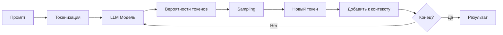

#### Tokenization и Detokenization

**Токенизация** — процесс разбиения текста на токены (подстроки, которые модель понимает).

**Методы токенизации**:

1. **Word-level**: каждое слово = один токен
   - Проблема: большой словарь, не обрабатывает незнакомые слова

2. **Character-level**: каждый символ = один токен
   - Проблема: очень длинные последовательности

3. **Subword-level** (современный подход):
   - **BPE (Byte Pair Encoding)**: используется в GPT
   - **SentencePiece**: используется в T5, LLaMA
   - **WordPiece**: используется в BERT

**Пример BPE**:
```
"hello world" → ["hello", " world"]
"unhappiness" → ["un", "happiness"] или ["un", "happy", "ness"]
```

**Detokenization** — обратный процесс: объединение токенов обратно в текст.

#### Sampling стратегии

После того как модель выдает вероятности для следующего токена, нужно выбрать один. Различные стратегии дают разные результаты.

**1. Greedy Decoding**:
- Всегда выбираем токен с максимальной вероятностью
- Детерминированный, но может быть скучным и повторяющимся

```python
next_token = argmax(P(tokens))
```

**2. Random Sampling**:
- Выбираем токен случайно согласно распределению вероятностей
- Слишком случайный, может быть бессвязным

```python
next_token = sample(P(tokens))
```

**3. Temperature Sampling**:
- Контролируем "креативность" через параметр temperature

$$P'(w_i) = \frac{\exp(\log P(w_i) / \tau)}{\sum_j \exp(\log P(w_j) / \tau)}$$

где $\tau$ — temperature:
- $\tau < 1$: более детерминированный (фокусируется на вероятных токенах)
- $\tau = 1$: использует исходное распределение
- $\tau > 1$: более случайный (сглаживает распределение)

**4. Top-k Sampling**:
- Рассматриваем только k наиболее вероятных токенов
- Сэмплируем из этого подмножества

```python
top_k_tokens = tokens[:k]  # k наиболее вероятных
next_token = sample(P(top_k_tokens))
```

**5. Top-p (Nucleus) Sampling**:
- Рассматриваем минимальное множество токенов с суммарной вероятностью ≥ p
- Более адаптивный, чем top-k

```python
cumulative_prob = 0
candidates = []
for token in sorted_by_prob:
    cumulative_prob += P(token)
    candidates.append(token)
    if cumulative_prob >= p:
        break
next_token = sample(P(candidates))
```

**Сравнение стратегий**:

| Стратегия | Детерминированность | Разнообразие | Использование |
|-----------|---------------------|--------------|---------------|
| Greedy | Высокая | Низкая | Простые задачи |
| Temperature | Зависит от τ | Контролируемое | Универсальное |
| Top-k | Средняя | Средняя | Баланс качества/разнообразия |
| Top-p | Средняя | Высокая | Современный стандарт |

#### Beam Search

**Beam Search** — метод поиска, который поддерживает несколько гипотез одновременно.

**Процесс**:
1. На каждом шаге сохраняем top-k последовательностей (beam width)
2. Для каждой последовательности генерируем следующие токены
3. Выбираем top-k из всех возможных продолжений
4. Повторяем до конца генерации

**Преимущества**:
- Находит более вероятные последовательности, чем greedy
- Учитывает глобальную вероятность последовательности

**Недостатки**:
- Медленнее, чем greedy (в k раз)
- Может быть слишком "безопасным" (избегает рискованных, но интересных вариантов)

**Математически**:
Ищем последовательность, максимизирующую:
$$\sum_{i=1}^{n} \log P(w_i | w_1, ..., w_{i-1})$$

### Оптимизация инференса

Инференс LLM может быть медленным и ресурсоемким. Существует множество техник оптимизации.

#### Квантизация (Quantization)

**Квантизация** — уменьшение точности представления весов модели.

**Типы квантизации**:

1. **FP32 → FP16**:
   - Уменьшение памяти в 2 раза
   - Минимальная потеря точности
   - Поддерживается современными GPU

2. **FP16 → INT8**:
   - Уменьшение памяти в 2 раза (относительно FP16)
   - Требует калибровки
   - Может немного снизить качество

3. **INT8 → INT4**:
   - Уменьшение памяти еще в 2 раза
   - Более значительная потеря точности
   - Требует специальных техник (GPTQ, AWQ)

**Математика квантизации**:

Для INT8:
$$Q(x) = \text{round}\left(\frac{x - \text{zero\_point}}{\text{scale}}\right)$$

где:
- `scale` = (max - min) / 255
- `zero_point` = -min / scale

**Методы квантизации**:
- **Post-training Quantization**: квантизация после обучения
- **Quantization-Aware Training (QAT)**: обучение с учетом квантизации

#### Pruning (обрезка весов)

**Pruning** — удаление неважных весов или нейронов.

**Типы**:
- **Magnitude-based**: удаляем веса с наименьшими абсолютными значениями
- **Structured**: удаляем целые нейроны или каналы
- **Unstructured**: удаляем отдельные веса (требует sparse матриц)

**Процесс**:
1. Обучаем модель
2. Определяем неважные веса
3. Удаляем их (обнуляем)
4. Опционально: дообучаем модель

#### Knowledge Distillation

**Knowledge Distillation** — обучение маленькой модели (student) на выходе большой модели (teacher).

**Цель**: получить модель меньшего размера с похожим качеством.

**Процесс**:
1. Большая модель (teacher) генерирует "мягкие" предсказания (soft labels)
2. Маленькая модель (student) учится предсказывать эти soft labels
3. Student также учится на hard labels (ground truth)

**Loss**:
$$L = \alpha \cdot L_{soft} + (1-\alpha) \cdot L_{hard}$$

где $L_{soft}$ использует temperature для сглаживания распределения teacher модели.

#### KV-Cache оптимизация

**Проблема**: При авторегрессионной генерации мы многократно вычисляем attention для одних и тех же предыдущих токенов.

**Решение**: **KV-Cache** — кэширование ключей и значений для предыдущих токенов.

**Без KV-Cache**:
```
Шаг 1: [tok1] → вычисляем Q, K, V для tok1
Шаг 2: [tok1, tok2] → вычисляем Q, K, V для tok1 и tok2 (повторно!)
Шаг 3: [tok1, tok2, tok3] → вычисляем Q, K, V для всех (повторно!)
```

**С KV-Cache**:
```
Шаг 1: [tok1] → вычисляем и кэшируем K, V для tok1
Шаг 2: [tok1, tok2] → используем кэш для tok1, вычисляем только для tok2
Шаг 3: [tok1, tok2, tok3] → используем кэш для tok1, tok2, вычисляем только для tok3
```

**Ускорение**: значительное уменьшение вычислений, особенно для длинных последовательностей.

#### Batch Processing vs Streaming

**Batch Processing**:
- Обрабатываем несколько запросов одновременно
- Эффективнее использование GPU
- Увеличивает latency (ждем, пока соберется батч)

**Streaming**:
- Генерируем токены по мере их появления
- Низкая latency для первого токена
- Менее эффективное использование GPU

**Continuous Batching** (современный подход):
- Комбинирует преимущества обоих
- Динамически добавляет/удаляет запросы из батча
- Используется в vLLM, TensorRT-LLM

---

## Сервинг (Serving) LLM

### Развертывание моделей

**Сервинг (Serving)** — процесс развертывания обученной модели для использования в production окружении.

#### Онлайн vs офлайн инференс

**Онлайн инференс (Online/Real-time)**:
- Запросы обрабатываются в реальном времени
- Низкая latency критична
- Используется в чат-ботах, API сервисах
- Требует постоянной доступности GPU/TPU

**Офлайн инференс (Offline/Batch)**:
- Обработка больших объемов данных заранее
- Latency менее критична
- Используется для предобработки данных, анализа
- Может использовать менее мощное оборудование

#### Модели как сервис (MaaS)

**MaaS (Models as a Service)** — подход, где модели предоставляются через API.

**Преимущества**:
- Не нужно управлять инфраструктурой
- Автоматическое масштабирование
- Регулярные обновления моделей
- Оплата по использованию

**Примеры**:
- OpenAI API (GPT-3, GPT-4)
- Anthropic API (Claude)
- Google Cloud AI (PaLM)
- Azure OpenAI Service

**Архитектура MaaS**:

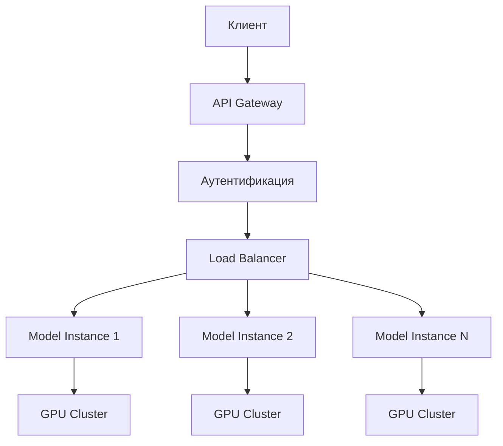

#### Edge deployment

**Edge deployment** — развертывание моделей на устройствах пользователя или близко к ним.

**Преимущества**:
- Низкая latency (нет сетевой задержки)
- Приватность (данные не отправляются на сервер)
- Работа офлайн

**Вызовы**:
- Ограниченные ресурсы (память, вычисления)
- Требуется квантизация и оптимизация
- Меньшие модели (MobileBERT, DistilBERT)

**Технологии**:
- ONNX Runtime (кроссплатформенный)
- TensorFlow Lite
- Core ML (Apple)
- TensorRT (NVIDIA)

### Инфраструктура сервинга

#### GPU/TPU требования

**GPU (Graphics Processing Unit)**:
- **NVIDIA**: A100, H100 (training), V100, T4 (inference)
- **Память**: критична для больших моделей
  - GPT-3 175B требует ~350GB памяти (FP16)
  - С квантизацией: ~175GB (INT8) или ~88GB (INT4)

**TPU (Tensor Processing Unit)**:
- Специализированные чипы от Google
- Оптимизированы для матричных операций
- Используются в Google Cloud

**Выбор оборудования**:
- **Training**: A100/H100 (большая память, высокая производительность)
- **Inference**: T4, A10 (более экономичные)
- **Edge**: Jetson (NVIDIA), Coral (Google)

#### Масштабирование

**Vertical Scaling (вертикальное)**:
- Увеличение мощности одного сервера
- Более мощные GPU, больше памяти
- Ограничено физическими возможностями

**Horizontal Scaling (горизонтальное)**:
- Добавление большего количества серверов
- Распределение нагрузки между инстансами
- Более гибкое, но требует балансировки нагрузки

**Автоматическое масштабирование**:
- **Scale-up**: при высокой нагрузке
- **Scale-down**: при низкой нагрузке (экономия ресурсов)
- Используется в Kubernetes, облачных сервисах

#### Load Balancing

**Load Balancing** — распределение запросов между несколькими инстансами модели.

**Стратегии**:
- **Round-robin**: поочередное распределение
- **Least connections**: на сервер с наименьшим количеством соединений
- **Weighted**: с учетом мощности серверов

**Вызовы для LLM**:
- Запросы имеют разную длину (разное время обработки)
- Нужно учитывать текущую загрузку GPU
- Streaming ответы усложняют балансировку

#### Мониторинг и метрики

**Ключевые метрики**:

**1. Latency (задержка)**:
- **Time to First Token (TTFT)**: время до первого токена
- **Time per Output Token (TPOT)**: время генерации каждого токена
- **End-to-end latency**: полное время ответа

**2. Throughput (пропускная способность)**:
- **Tokens per second (TPS)**: токенов в секунду
- **Requests per second (RPS)**: запросов в секунду
- Зависит от batch size, длины последовательности

**3. Cost (стоимость)**:
- **Cost per token**: стоимость генерации одного токена
- **Cost per request**: стоимость обработки запроса
- Включает GPU время, энергопотребление

**4. Quality (качество)**:
- Perplexity (для языкового моделирования)
- BLEU, ROUGE (для генерации)
- Human evaluation scores

**Мониторинг в production**:
- Логирование всех запросов и ответов
- Трекинг метрик в реальном времени (Prometheus, Grafana)
- Алерты при аномалиях
- A/B тестирование моделей

### Инструменты и фреймворки

#### vLLM

**vLLM** — высокопроизводительный inference engine для LLM.

**Ключевые особенности**:
- **PagedAttention**: эффективное управление памятью для KV-cache
- **Continuous batching**: динамический батчинг
- **Высокий throughput**: до 24x быстрее стандартного Hugging Face

**Установка**:
```bash
pip install vllm
```

**Использование**:
```python
from vllm import LLM, SamplingParams

llm = LLM(model="meta-llama/Llama-2-7b-chat-hf")
sampling_params = SamplingParams(temperature=0.8, top_p=0.95)
outputs = llm.generate(["Hello, my name is"], sampling_params)
```

**Оптимизации**:
- PagedAttention: уменьшает фрагментацию памяти
- Continuous batching: эффективное использование GPU
- Tensor parallelism: распределение модели между GPU

#### TensorRT-LLM

**TensorRT-LLM** — оптимизация LLM через NVIDIA TensorRT.

**Особенности**:
- Квантизация (INT8, INT4, FP8)
- Kernel fusion: объединение операций
- Оптимизация для конкретных GPU
- Поддержка multi-GPU inference

**Использование**:
```bash
# Компиляция модели
trtllm-build --checkpoint_dir ./checkpoints \
             --output_dir ./engines \
             --gemm_plugin float16

# Запуск inference
python run.py --engine_dir ./engines
```

#### Triton Inference Server

**Triton** — универсальный inference server от NVIDIA.

**Особенности**:
- Поддержка множества фреймворков (PyTorch, TensorFlow, ONNX, TensorRT)
- Динамический батчинг
- Модель версионирование
- Мониторинг и метрики

**Архитектура**:
```
Client → Triton Server → Model Repository → GPU
```

**Конфигурация** (config.pbtxt):
```protobuf
name: "llm_model"
platform: "pytorch_libtorch"
max_batch_size: 8
input [
  {
    name: "input_ids"
    data_type: TYPE_INT64
    dims: [ -1 ]
  }
]
```

#### Hugging Face Transformers + Text Generation Inference

**Hugging Face Transformers** — стандартная библиотека для работы с LLM.

**Text Generation Inference (TGI)** — оптимизированный сервер для генерации текста.

**Особенности TGI**:
- Tensor parallelism
- Continuous batching
- Flash Attention (оптимизация attention)
- Поддержка PEFT (Parameter-Efficient Fine-Tuning)

**Запуск**:
```bash
docker run --gpus all \
  -p 8080:80 \
  -v $PWD/data:/data \
  ghcr.io/huggingface/text-generation-inference:latest \
  --model-id meta-llama/Llama-2-7b-chat-hf \
  --num-shard 1
```

**API**:
```python
import requests

response = requests.post(
    "http://localhost:8080/generate",
    json={
        "inputs": "Hello, my name is",
        "parameters": {"max_new_tokens": 50, "temperature": 0.7}
    }
)
```

#### ONNX Runtime

**ONNX Runtime** — кроссплатформенный inference engine.

**Преимущества**:
- Оптимизация для разных платформ (CPU, GPU, мобильные)
- Квантизация
- Графовые оптимизации

**Конвертация модели**:
```python
from transformers import AutoModel
import torch

model = AutoModel.from_pretrained("bert-base-uncased")
dummy_input = torch.randint(0, 1000, (1, 128))

torch.onnx.export(
    model,
    dummy_input,
    "model.onnx",
    input_names=["input_ids"],
    output_names=["output"],
    dynamic_axes={"input_ids": {0: "batch"}, "output": {0: "batch"}}
)
```

**Inference**:
```python
import onnxruntime as ort

session = ort.InferenceSession("model.onnx")
outputs = session.run(None, {"input_ids": input_ids.numpy()})
```

#### Сравнение инструментов

| Инструмент | Скорость | Простота | Гибкость | Использование |
|------------|----------|----------|----------|---------------|
| vLLM | Очень высокая | Средняя | Высокая | Production inference |
| TensorRT-LLM | Очень высокая | Низкая | Средняя | NVIDIA GPU оптимизация |
| Triton | Высокая | Средняя | Очень высокая | Enterprise deployment |
| TGI | Высокая | Высокая | Средняя | Hugging Face экосистема |
| ONNX Runtime | Средняя | Высокая | Высокая | Кроссплатформенность |

---

## RAG (Retrieval-Augmented Generation)

### Что такое RAG

**RAG (Retrieval-Augmented Generation)** — это архитектурный паттерн, который комбинирует поиск информации из внешних источников данных с генерацией текста LLM.

#### Определение и мотивация

**Проблемы чистых LLM**:
1. **Hallucination (галлюцинации)**: модель генерирует информацию, которой нет в её обучающих данных или которая неверна
2. **Устаревшие знания**: модель знает только то, на чем обучалась (cutoff date)
3. **Отсутствие доступа к приватным данным**: модель не знает внутренние документы компании
4. **Отсутствие источников**: модель не может указать, откуда взяла информацию

**Решение RAG**:
- **Retrieval**: поиск релевантной информации из внешних источников (векторная БД, документы)
- **Augmentation**: обогащение промпта найденной информацией
- **Generation**: генерация ответа на основе обогащенного контекста

#### Проблемы, которые решает RAG

1. **Актуальность данных**: модель может использовать свежие данные из внешних источников
2. **Точность**: ответы основаны на реальных документах, а не только на знаниях модели
3. **Прозрачность**: можно указать источники информации
4. **Специализация**: использование доменно-специфичных данных без переобучения модели

#### Архитектура RAG системы

**Базовая архитектура RAG**:

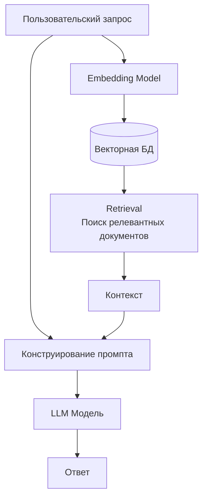

**Процесс**:
1. **Индексация** (offline):
   - Загрузка документов
   - Разбиение на чанки (chunks)
   - Генерация embeddings
   - Сохранение в векторную БД

2. **Retrieval** (online):
   - Преобразование запроса в embedding
   - Поиск похожих чанков в векторной БД
   - Извлечение top-k релевантных документов

3. **Augmentation**:
   - Добавление найденных документов в промпт
   - Конструирование контекстного промпта

4. **Generation**:
   - Генерация ответа LLM на основе обогащенного промпта

### Компоненты RAG

#### Retrieval (поиск)

**Embedding модели**

Embedding модели преобразуют текст в векторы (числовые представления), которые сохраняют семантическое сходство.

**Популярные embedding модели**:
- **OpenAI text-embedding-ada-002**: универсальная, высокая производительность
- **Sentence-BERT**: оптимизирован для семантического поиска
- **BGE (BAAI General Embedding)**: открытая модель, высокая производительность
- **E5**: эффективные embeddings

**Пример использования**:
```python
from sentence_transformers import SentenceTransformer

model = SentenceTransformer('all-MiniLM-L6-v2')
embeddings = model.encode(["текст для индексации"])
query_embedding = model.encode(["поисковый запрос"])
```

**Векторные базы данных**

Векторные БД оптимизированы для хранения и поиска векторов по сходству.

**Популярные векторные БД**:

1. **Pinecone**:
   - Управляемый сервис
   - Высокая производительность
   - Простота использования

2. **Weaviate**:
   - Open-source
   - Поддержка гибридного поиска
   - GraphQL API

3. **Qdrant**:
   - Open-source
   - Высокая производительность
   - Rust-based

4. **FAISS** (Facebook AI Similarity Search):
   - Библиотека от Facebook
   - Для локального использования
   - Очень быстрый поиск

5. **Chroma**:
   - Легковесная
   - Простая интеграция
   - Хороша для прототипирования

**Пример с FAISS**:
```python
import faiss
import numpy as np

# Создание индекса
dimension = 384  # размерность embedding
index = faiss.IndexFlatL2(dimension)

# Добавление векторов
vectors = np.array(embeddings).astype('float32')
index.add(vectors)

# Поиск
k = 5  # top-k результатов
distances, indices = index.search(query_embedding.reshape(1, -1), k)
```

**Поиск по сходству**

**Cosine Similarity** (косинусное сходство):
$$\text{cosine}(A, B) = \frac{A \cdot B}{||A|| \cdot ||B||} = \frac{\sum_{i} A_i B_i}{\sqrt{\sum_{i} A_i^2} \cdot \sqrt{\sum_{i} B_i^2}}$$

**Dot Product** (скалярное произведение):
$$\text{dot}(A, B) = A \cdot B = \sum_{i} A_i B_i$$

**Euclidean Distance** (евклидово расстояние):
$$d(A, B) = \sqrt{\sum_{i} (A_i - B_i)^2}$$

Для нормализованных векторов: cosine similarity ≈ dot product.

**Hybrid Search** (гибридный поиск)

Комбинация векторного поиска и keyword search (BM25, TF-IDF).

**Преимущества**:
- Векторный поиск: семантическое сходство
- Keyword search: точное совпадение терминов
- Комбинация: лучшее из обоих миров

**Математика гибридного поиска**:
$$\text{score} = \alpha \cdot \text{vector\_score} + (1-\alpha) \cdot \text{keyword\_score}$$

где $\alpha$ — вес векторного поиска (обычно 0.7-0.8).

#### Augmentation (обогащение контекста)

**Chunking стратегии**

Документы разбиваются на чанки для эффективного поиска и обработки.

**Стратегии chunking**:

1. **Fixed-size chunks**:
   - Фиксированный размер (например, 512 токенов)
   - Простая реализация
   - Может разрывать контекст

2. **Sentence-based chunks**:
   - Разбиение по предложениям
   - Сохраняет семантическую целостность
   - Переменный размер

3. **Semantic chunks**:
   - Разбиение на основе семантической близости
   - Использует embedding для определения границ
   - Более сложная, но эффективная

4. **Sliding window**:
   - Перекрывающиеся чанки
   - Сохраняет контекст на границах
   - Увеличивает объем данных

**Пример chunking**:
```python
from langchain.text_splitter import RecursiveCharacterTextSplitter

text_splitter = RecursiveCharacterTextSplitter(
    chunk_size=512,
    chunk_overlap=50,
    length_function=len,
)
chunks = text_splitter.split_text(document)
```

**Контекстное окно**

LLM имеют ограничение на длину контекста (context window):
- GPT-3.5: 4K токенов
- GPT-4: 8K-32K токенов
- Claude: до 200K токенов
- LLaMA 2: 4K токенов

**Проблема**: нужно уместить промпт + контекст + ответ в контекстное окно.

**Решение**:
- Выбирать только самые релевантные чанки
- Использовать сжатие контекста
- Приоритизировать важную информацию

**Re-ranking**

После первоначального поиска можно переранжировать результаты для улучшения релевантности.

**Cross-encoder модели**:
- Более точные, чем embedding модели
- Медленнее (нельзя предвычислить)
- Используются для re-ranking небольшого набора кандидатов

**Процесс**:
1. Retrieval: находим top-k (например, 20) кандидатов через векторный поиск
2. Re-ranking: переранжируем через cross-encoder
3. Выбираем top-n (например, 5) для контекста

**Пример**:
```python
from sentence_transformers import CrossEncoder

reranker = CrossEncoder('cross-encoder/ms-marco-MiniLM-L-6-v2')
scores = reranker.predict([(query, doc) for doc in candidates])
ranked = sorted(zip(candidates, scores), key=lambda x: x[1], reverse=True)
```

#### Generation (генерация)

**Prompt engineering для RAG**

Промпт должен четко указывать модели использовать предоставленный контекст.

**Шаблон промпта**:
```
Контекст:
{retrieved_documents}

Вопрос: {user_query}

Ответ (используй только информацию из контекста):
```

**Улучшенный шаблон**:
```
Ты помощник, который отвечает на вопросы на основе предоставленного контекста.

Контекст:
{retrieved_documents}

Инструкции:
- Используй только информацию из контекста
- Если ответа нет в контексте, скажи "Я не знаю"
- Укажи источники информации

Вопрос: {user_query}

Ответ:
```

**Контекстная генерация**

Модель генерирует ответ, основываясь на:
1. Своих предобученных знаниях
2. Предоставленном контексте из retrieval

**Важно**: модель должна приоритизировать контекст над предобученными знаниями.

### Типы RAG

#### Naive RAG

**Базовая RAG** — простейшая реализация:
1. Индексация документов
2. Поиск по запросу
3. Генерация ответа

**Ограничения**:
- Нет оптимизации запроса
- Нет re-ranking
- Может извлекать нерелевантные чанки

#### Advanced RAG

**Улучшенная RAG** с дополнительными компонентами:

**1. Query Rewriting**:
- Переформулирование запроса для лучшего поиска
- Пример: "Что такое ML?" → "машинное обучение определение"

**2. Query Expansion**:
- Расширение запроса синонимами
- Пример: "автомобиль" → "автомобиль машина авто"

**3. Re-ranking**:
- Переранжирование результатов через cross-encoder

**4. Context Compression**:
- Сжатие извлеченного контекста
- Удаление нерелевантных частей

**Архитектура Advanced RAG**:

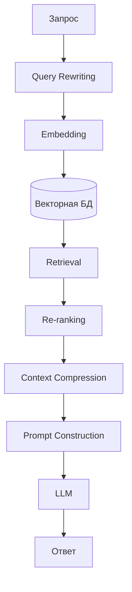

#### Modular RAG

**Модульная RAG** — гибкая архитектура с настраиваемыми компонентами.

**Модули**:
- **Query Router**: определяет тип запроса
- **Retriever**: различные стратегии поиска
- **Generator**: различные модели генерации
- **Evaluator**: оценка качества ответа

**Преимущества**:
- Гибкость в выборе компонентов
- Легко экспериментировать
- Адаптация под конкретные задачи

#### Agentic RAG

**Агентная RAG** — комбинация RAG с агентами.

**Особенности**:
- Агент может делать несколько запросов к RAG
- Итеративное уточнение поиска
- Использование инструментов для поиска
- Планирование последовательности действий

**Пример**:
1. Агент получает вопрос
2. Формулирует поисковый запрос
3. Получает результаты из RAG
4. Анализирует результаты
5. При необходимости делает дополнительные запросы
6. Генерирует финальный ответ

**Архитектура Agentic RAG**:

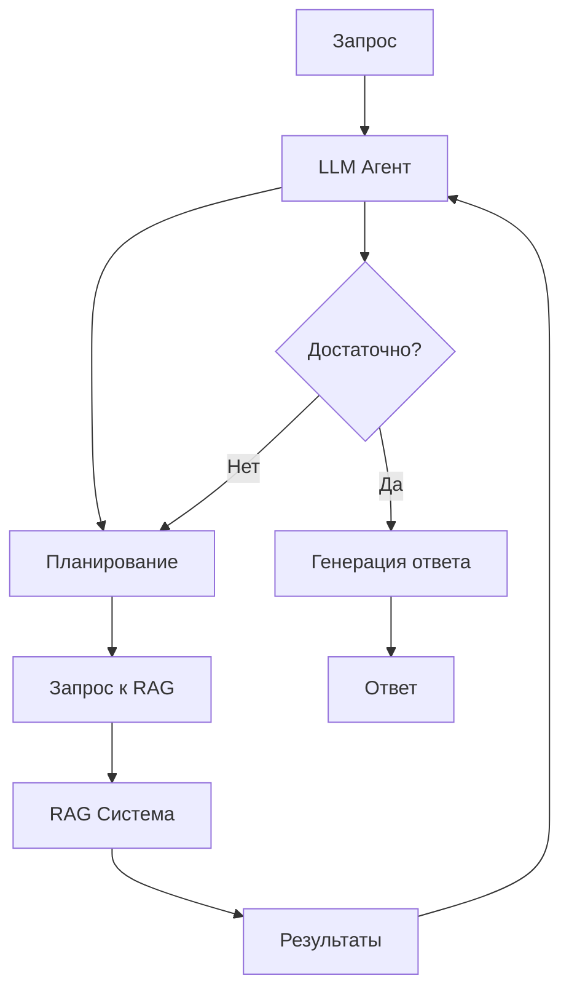

---

## LLM Агенты

### Что такое агенты

**LLM Агент** — это система, которая использует LLM для принятия решений и выполнения действий в окружающей среде для достижения целей.

#### Определение и концепция

**Отличие от простого LLM вызова**:

**Простой LLM вызов**:
```
Пользователь → Промпт → LLM → Ответ → Пользователь
```
- Одноразовое взаимодействие
- Нет памяти о предыдущих действиях
- Нет доступа к внешним инструментам

**LLM Агент**:
```
Пользователь → Цель → Агент (LLM + Память + Инструменты) → Действия → Результаты → Агент → ...
```
- Многошаговое планирование
- Использование инструментов
- Сохранение контекста и памяти
- Итеративное выполнение задач

#### Компоненты агента

**1. Reasoning (рассуждение)**:
- Анализ задачи
- Разбиение на подзадачи
- Принятие решений

**2. Planning (планирование)**:
- Создание плана действий
- Определение последовательности шагов
- Адаптация плана при необходимости

**3. Action (действие)**:
- Выполнение действий через инструменты
- Взаимодействие с внешними системами
- Вызов функций, API, баз данных

**4. Observation (наблюдение)**:
- Получение результатов действий
- Анализ обратной связи
- Обновление состояния

**Цикл агента**:

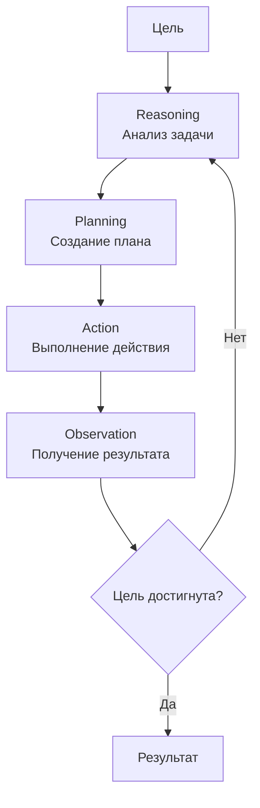

### Архитектура агентов

#### ReAct (Reasoning + Acting)

**ReAct** — архитектура, которая чередует рассуждения и действия.

**Формат**:
```
Мысль: [рассуждение агента]
Действие: [название инструмента]
Действие Вход: [параметры]
Наблюдение: [результат действия]
...
Мысль: [следующее рассуждение]
...
Ответ: [финальный ответ]
```

**Пример**:
```
Вопрос: Какая столица Франции и какая там погода?

Мысль: Мне нужно найти столицу Франции и затем узнать погоду там.
Действие: search
Действие Вход: столица Франции
Наблюдение: Париж является столицей Франции.

Мысль: Теперь мне нужно узнать погоду в Париже.
Действие: get_weather
Действие Вход: Париж
Наблюдение: В Париже сейчас 15°C, облачно.

Ответ: Столица Франции — Париж. Там сейчас 15°C и облачно.
```

**Преимущества**:
- Прозрачность: видно ход мыслей агента
- Отладка: легко понять, где произошла ошибка
- Гибкость: может адаптироваться к результатам

#### Plan-and-Execute

**Plan-and-Execute** — двухэтапная архитектура:
1. **Планирование**: создание полного плана заранее
2. **Выполнение**: последовательное выполнение шагов плана

**Архитектура**:

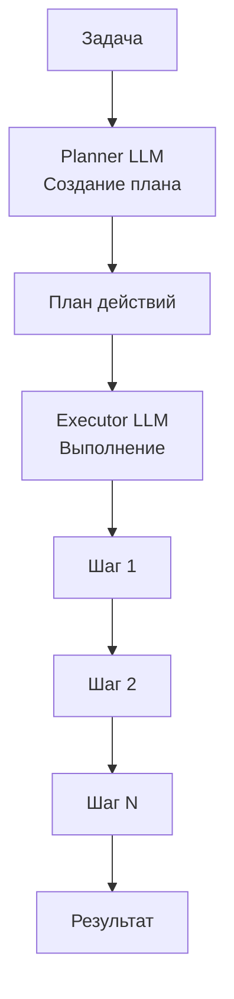

**Преимущества**:
- Эффективность: план создается один раз
- Структурированность: четкая последовательность

**Недостатки**:
- Негибкость: сложно адаптироваться к неожиданным результатам
- Планирование может быть неточным

#### Reflexion

**Reflexion** — агенты с саморефлексией и обучением на ошибках.

**Компоненты**:
1. **Actor**: выполняет действия
2. **Evaluator**: оценивает результаты
3. **Self-reflection**: анализ ошибок и улучшение

**Процесс**:
```
Действие → Результат → Оценка → Рефлексия → Улучшенное действие
```

**Пример**:
```
Действие: поиск информации о Python
Результат: нерелевантная информация
Оценка: плохо
Рефлексия: запрос был слишком общим, нужно уточнить
Улучшенное действие: поиск "Python programming language tutorial"
```

#### Tool use и Function Calling

**Tool use** — способность агента использовать внешние инструменты (функции, API, сервисы).

**Function Calling** — механизм, позволяющий LLM вызывать функции.

**Процесс**:
1. LLM анализирует запрос
2. Определяет, какие инструменты нужны
3. Генерирует вызов функции с параметрами
4. Система выполняет функцию
5. Результат возвращается в LLM
6. LLM продолжает генерацию с учетом результата

**Пример определения инструментов** (OpenAI Function Calling):
```python
tools = [
    {
        "type": "function",
        "function": {
            "name": "get_weather",
            "description": "Получить текущую погоду в городе",
            "parameters": {
                "type": "object",
                "properties": {
                    "location": {
                        "type": "string",
                        "description": "Название города"
                    }
                },
                "required": ["location"]
            }
        }
    }
]
```

**Пример использования**:
```python
response = client.chat.completions.create(
    model="gpt-4",
    messages=[{"role": "user", "content": "Какая погода в Москве?"}],
    tools=tools
)

# LLM возвращает:
# tool_calls: [{"name": "get_weather", "arguments": {"location": "Москва"}}]

# Выполняем функцию
weather = get_weather(location="Москва")

# Передаем результат обратно в LLM
response = client.chat.completions.create(
    model="gpt-4",
    messages=[
        {"role": "user", "content": "Какая погода в Москве?"},
        {"role": "assistant", "content": None, "tool_calls": [...]},
        {"role": "tool", "content": str(weather)}
    ]
)
```

### Типы агентов

#### Single-agent системы

**Один агент** решает задачу самостоятельно.

**Характеристики**:
- Простая архитектура
- Полный контроль над процессом
- Подходит для простых задач

**Примеры**:
- Персональный ассистент
- Автоматизация простых задач
- Анализ документов

#### Multi-agent системы

**Несколько агентов** работают вместе для решения сложных задач.

**Архитектура**:

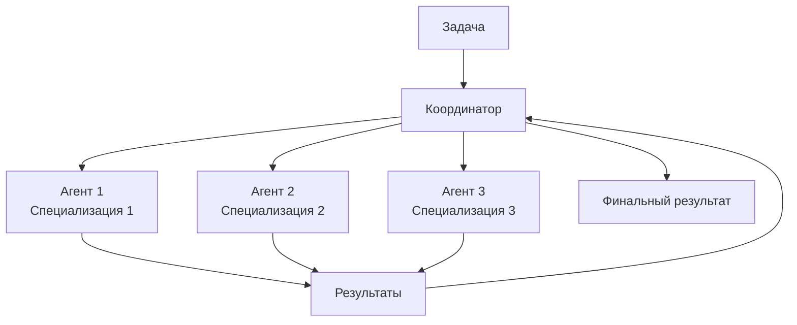

**Преимущества**:
- Специализация: каждый агент эксперт в своей области
- Параллелизм: агенты могут работать одновременно
- Масштабируемость: легко добавлять новых агентов

**Примеры**:
- **CrewAI**: фреймворк для multi-agent систем
- **AutoGen**: Microsoft framework для multi-agent диалогов
- **Swarm**: коллективный интеллект агентов

#### Autonomous agents

**Автономные агенты** работают независимо, без постоянного контроля человека.

**Характеристики**:
- Долгосрочные цели
- Самостоятельное планирование
- Адаптация к изменениям
- Непрерывная работа

**Примеры**:
- **AutoGPT**: автономный агент с долгосрочной памятью
- **BabyAGI**: задача-ориентированный агент
- Торговые боты

**Архитектура Autonomous Agent**:

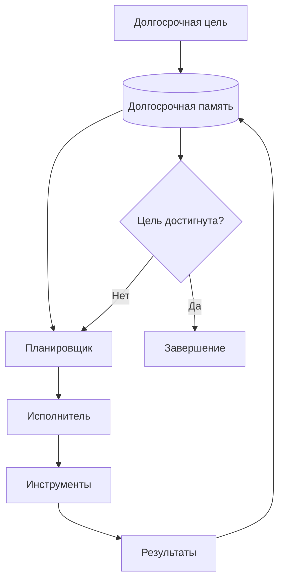

#### Supervised agents

**Супервизорные агенты** работают под контролем человека или другой системы.

**Характеристики**:
- Человек одобряет действия
- Безопасность: предотвращение вредных действий
- Обучение на основе обратной связи

**Примеры**:
- Агенты с human-in-the-loop
- Агенты с валидацией действий
- Агенты с ограничениями безопасности

### Инструменты и фреймворки

#### LangChain Agents

**LangChain** — популярный фреймворк для построения LLM приложений, включая агентов.

**Типы агентов в LangChain**:

1. **Zero-shot ReAct Agent**:
   - Использует LLM для выбора инструментов
   - Не требует примеров

2. **ReAct Document Store Agent**:
   - Специализирован для работы с документами
   - Использует векторные БД

3. **Self-ask with Search Agent**:
   - Задает себе вопросы
   - Ищет ответы через поиск

**Пример**:
```python
from langchain.agents import initialize_agent, Tool
from langchain.llms import OpenAI

llm = OpenAI(temperature=0)

tools = [
    Tool(
        name="Calculator",
        func=lambda x: eval(x),
        description="Выполняет математические вычисления"
    ),
    Tool(
        name="Search",
        func=search_function,
        description="Ищет информацию в интернете"
    )
]

agent = initialize_agent(
    tools,
    llm,
    agent="zero-shot-react-description",
    verbose=True
)

agent.run("Сколько будет 25 * 4 и найди информацию о Python?")
```

#### LlamaIndex Agents

**LlamaIndex** — фреймворк для работы с данными и LLM, включает агентов.

**Особенности**:
- Интеграция с RAG
- Работа с структурированными данными
- Query engines как инструменты

**Пример**:
```python
from llama_index.agent import ReActAgent
from llama_index.tools import QueryEngineTool

# Создание query engine
query_engine = index.as_query_engine()

# Преобразование в инструмент
tool = QueryEngineTool.from_defaults(
    query_engine=query_engine,
    name="document_search",
    description="Ищет информацию в документах"
)

# Создание агента
agent = ReActAgent.from_tools([tool], llm=llm, verbose=True)
response = agent.chat("Что говорится в документах о машинном обучении?")
```

#### AutoGPT

**AutoGPT** — автономный агент, который может выполнять сложные задачи с минимальным вмешательством.

**Особенности**:
- Долгосрочная память (векторная БД)
- Веб-поиск
- Файловые операции
- Планирование и выполнение задач

**Архитектура**:
```
Цель → Планирование → Действие → Критика → Следующее действие → ...
```

#### CrewAI

**CrewAI** — фреймворк для создания multi-agent систем.

**Концепции**:
- **Agents**: специализированные агенты с ролями
- **Tasks**: задачи для агентов
- **Crew**: команда агентов, работающих вместе

**Пример**:
```python
from crewai import Agent, Task, Crew

researcher = Agent(
    role='Исследователь',
    goal='Найти информацию о теме',
    backstory='Эксперт в поиске информации'
)

writer = Agent(
    role='Писатель',
    goal='Написать статью',
    backstory='Опытный писатель'
)

task1 = Task(
    description='Исследовать тему машинного обучения',
    agent=researcher
)

task2 = Task(
    description='Написать статью на основе исследования',
    agent=writer
)

crew = Crew(agents=[researcher, writer], tasks=[task1, task2])
result = crew.kickoff()
```

#### Agentic patterns

**Паттерны построения агентов**:

1. **Sequential Chain**:
   - Последовательное выполнение задач
   - Выход одного агента → вход следующего

2. **Parallel Processing**:
   - Параллельное выполнение независимых задач
   - Агрегация результатов

3. **Hierarchical**:
   - Иерархия агентов
   - Менеджер координирует подчиненных

4. **Swarm**:
   - Коллективный интеллект
   - Агенты обмениваются информацией

5. **Orchestrator**:
   - Центральный оркестратор управляет агентами
   - Динамическое распределение задач

---

## Практические примеры

### Пример 1: Простой инференс с Hugging Face

**Базовый пример использования LLM для генерации текста**:

```python
from transformers import AutoTokenizer, AutoModelForCausalLM
import torch

# Загрузка модели и токенизатора
model_name = "gpt2"  # или другая модель
tokenizer = AutoTokenizer.from_pretrained(model_name)
model = AutoModelForCausalLM.from_pretrained(model_name)

# Подготовка промпта
prompt = "Машинное обучение — это"
inputs = tokenizer(prompt, return_tensors="pt")

# Генерация
with torch.no_grad():
    outputs = model.generate(
        inputs.input_ids,
        max_length=100,
        temperature=0.7,
        top_p=0.9,
        do_sample=True,
        pad_token_id=tokenizer.eos_token_id
    )

# Декодирование результата
generated_text = tokenizer.decode(outputs[0], skip_special_tokens=True)
print(generated_text)
```

**Использование pipeline** (более простой способ):
```python
from transformers import pipeline

generator = pipeline("text-generation", model="gpt2")
result = generator(
    "Машинное обучение — это",
    max_length=100,
    temperature=0.7,
    top_p=0.9,
    num_return_sequences=1
)
print(result[0]['generated_text'])
```

### Пример 2: Настройка RAG системы

**Полный пример RAG системы с использованием LangChain и FAISS**:

```python
from langchain.document_loaders import TextLoader
from langchain.text_splitter import RecursiveCharacterTextSplitter
from langchain.embeddings import HuggingFaceEmbeddings
from langchain.vectorstores import FAISS
from langchain.llms import OpenAI
from langchain.chains import RetrievalQA

# 1. Загрузка документов
loader = TextLoader("document.txt")
documents = loader.load()

# 2. Разбиение на чанки
text_splitter = RecursiveCharacterTextSplitter(
    chunk_size=512,
    chunk_overlap=50
)
chunks = text_splitter.split_documents(documents)

# 3. Создание embeddings и векторной БД
embeddings = HuggingFaceEmbeddings(
    model_name="sentence-transformers/all-MiniLM-L6-v2"
)
vectorstore = FAISS.from_documents(chunks, embeddings)

# 4. Создание LLM
llm = OpenAI(temperature=0)

# 5. Создание RAG цепи
qa_chain = RetrievalQA.from_chain_type(
    llm=llm,
    chain_type="stuff",
    retriever=vectorstore.as_retriever(search_kwargs={"k": 3})
)

# 6. Использование
query = "Что говорится в документе о машинном обучении?"
answer = qa_chain.run(query)
print(answer)
```

**Улучшенная версия с re-ranking**:
```python
from langchain.retrievers import ContextualCompressionRetriever
from langchain.retrievers.document_compressors import LLMChainExtractor

# Создание компрессора для фильтрации нерелевантных чанков
compressor = LLMChainExtractor.from_llm(llm)
compression_retriever = ContextualCompressionRetriever(
    base_compressor=compressor,
    base_retriever=vectorstore.as_retriever()
)

qa_chain = RetrievalQA.from_chain_type(
    llm=llm,
    chain_type="stuff",
    retriever=compression_retriever
)
```

### Пример 3: Создание простого агента

**ReAct агент с использованием LangChain**:

```python
from langchain.agents import initialize_agent, Tool, AgentType
from langchain.llms import OpenAI
from langchain.utilities import SerpAPIWrapper

# Инициализация LLM
llm = OpenAI(temperature=0)

# Определение инструментов
search = SerpAPIWrapper()
tools = [
    Tool(
        name="Search",
        func=search.run,
        description="Полезен для поиска актуальной информации в интернете"
    ),
    Tool(
        name="Calculator",
        func=lambda x: str(eval(x)),
        description="Полезен для выполнения математических вычислений"
    )
]

# Создание агента
agent = initialize_agent(
    tools,
    llm,
    agent=AgentType.ZERO_SHOT_REACT_DESCRIPTION,
    verbose=True
)

# Использование
result = agent.run(
    "Найди информацию о населении Москвы и умножь его на 2"
)
print(result)
```

**Агент с кастомными инструментами**:
```python
def get_weather(city: str) -> str:
    """Получить погоду в городе"""
    # Здесь был бы реальный API вызов
    return f"В {city} сейчас 20°C, солнечно"

def get_stock_price(symbol: str) -> str:
    """Получить цену акции"""
    # Здесь был бы реальный API вызов
    return f"Цена {symbol}: $150"

tools = [
    Tool(
        name="Weather",
        func=get_weather,
        description="Получить текущую погоду в городе. Вход: название города"
    ),
    Tool(
        name="StockPrice",
        func=get_stock_price,
        description="Получить цену акции. Вход: символ акции (например, AAPL)"
    )
]

agent = initialize_agent(
    tools,
    llm,
    agent=AgentType.ZERO_SHOT_REACT_DESCRIPTION,
    verbose=True
)

result = agent.run("Какая погода в Москве и цена акций Apple?")
```

### Пример 4: Оптимизация инференса

**Использование vLLM для высокопроизводительного инференса**:

```python
from vllm import LLM, SamplingParams

# Инициализация модели
llm = LLM(
    model="meta-llama/Llama-2-7b-chat-hf",
    tensor_parallel_size=2,  # Использование 2 GPU
    gpu_memory_utilization=0.9
)

# Параметры генерации
sampling_params = SamplingParams(
    temperature=0.7,
    top_p=0.9,
    max_tokens=100
)

# Генерация (batch processing)
prompts = [
    "Машинное обучение — это",
    "Искусственный интеллект — это",
    "Нейронные сети — это"
]

outputs = llm.generate(prompts, sampling_params)

# Вывод результатов
for output in outputs:
    prompt = output.prompt
    generated_text = output.outputs[0].text
    print(f"Промпт: {prompt}")
    print(f"Сгенерировано: {generated_text}\n")
```

**Квантизация модели для уменьшения размера**:
```python
from transformers import AutoModelForCausalLM, AutoTokenizer
import torch

model_name = "gpt2"
tokenizer = AutoTokenizer.from_pretrained(model_name)
model = AutoModelForCausalLM.from_pretrained(model_name)

# Квантизация в INT8
quantized_model = torch.quantization.quantize_dynamic(
    model,
    {torch.nn.Linear},
    dtype=torch.qint8
)

# Сохранение квантизированной модели
torch.save(quantized_model.state_dict(), "quantized_model.pt")

# Использование
prompt = "Машинное обучение — это"
inputs = tokenizer(prompt, return_tensors="pt")
with torch.no_grad():
    outputs = quantized_model.generate(
        inputs.input_ids,
        max_length=50
    )
```

**Использование ONNX для оптимизации**:
```python
from transformers import AutoTokenizer, AutoModel
import torch.onnx

model_name = "bert-base-uncased"
tokenizer = AutoTokenizer.from_pretrained(model_name)
model = AutoModel.from_pretrained(model_name)
model.eval()

# Пример входных данных
dummy_input = torch.randint(0, 1000, (1, 128))

# Экспорт в ONNX
torch.onnx.export(
    model,
    dummy_input,
    "model.onnx",
    input_names=["input_ids"],
    output_names=["output"],
    dynamic_axes={
        "input_ids": {0: "batch_size"},
        "output": {0: "batch_size"}
    },
    opset_version=11
)

# Использование ONNX Runtime
import onnxruntime as ort

session = ort.InferenceSession("model.onnx")
input_ids = tokenizer("Hello, world!", return_tensors="pt")["input_ids"].numpy()
outputs = session.run(None, {"input_ids": input_ids})
```

### Пример 5: Комбинирование RAG и агентов

**Агент, использующий RAG для поиска информации**:

```python
from langchain.agents import initialize_agent, Tool
from langchain.llms import OpenAI
from langchain.vectorstores import FAISS
from langchain.embeddings import HuggingFaceEmbeddings
from langchain.chains import RetrievalQA

# Создание RAG системы
embeddings = HuggingFaceEmbeddings()
vectorstore = FAISS.load_local("faiss_index", embeddings)
qa_chain = RetrievalQA.from_chain_type(
    llm=OpenAI(),
    chain_type="stuff",
    retriever=vectorstore.as_retriever()
)

# Преобразование RAG в инструмент
def document_search(query: str) -> str:
    """Поиск информации в документах"""
    return qa_chain.run(query)

# Создание агента с RAG инструментом
tools = [
    Tool(
        name="DocumentSearch",
        func=document_search,
        description="Поиск информации в базе документов. Используй для вопросов о документах."
    )
]

agent = initialize_agent(
    tools,
    OpenAI(),
    agent="zero-shot-react-description",
    verbose=True
)

# Использование
result = agent.run(
    "Что говорится в документах о машинном обучении? "
    "Найди конкретные примеры использования."
)
```

---

## Заключение

### Ключевые концепции

В данном руководстве мы рассмотрели фундаментальные аспекты больших языковых моделей:

1. **Нейронные сети**: от классического ML к глубокому обучению, включая архитектуры CNN, RNN и Transformer
2. **LLM**: архитектура Transformer, механизм attention, процессы обучения (pre-training, fine-tuning, RLHF)
3. **Инференс**: генерация текста, sampling стратегии, оптимизации (квантизация, pruning, KV-cache)
4. **Сервинг**: развертывание моделей, инфраструктура, инструменты (vLLM, TensorRT-LLM, Triton)
5. **RAG**: комбинация поиска и генерации для работы с актуальными данными
6. **Агенты**: системы, использующие LLM для планирования и выполнения действий

### Тренды и будущее

**Текущие тренды**:
- **Мультимодальность**: модели, работающие с текстом, изображениями, аудио
- **Уменьшение размера**: более эффективные модели (LLaMA, Mistral)
- **Специализация**: доменно-специфичные модели
- **Агентность**: автономные агенты для сложных задач
- **Эффективность**: оптимизация для edge devices

**Будущие направления**:
- **Reasoning**: улучшение способности к рассуждению
- **Долгосрочная память**: сохранение контекста на длительное время
- **Мультиагентные системы**: координация множества агентов
- **Безопасность**: защита от jailbreak, prompt injection
- **Энергоэффективность**: снижение энергопотребления

### Рекомендации для изучения

**Для углубленного изучения**:

1. **Математические основы**:
   - Линейная алгебра (матричные операции)
   - Вероятность и статистика
   - Оптимизация (градиентный спуск, Adam)

2. **Практика**:
   - Работа с Hugging Face Transformers
   - Построение RAG систем
   - Создание агентов с LangChain/LlamaIndex
   - Оптимизация инференса

3. **Исследования**:
   - Чтение статей на arXiv (cs.CL)
   - Изучение архитектур новых моделей
   - Экспериментирование с различными подходами

4. **Инструменты**:
   - PyTorch / TensorFlow
   - Hugging Face экосистема
   - LangChain / LlamaIndex
   - vLLM / TensorRT-LLM

### Дополнительные ресурсы

**Официальная документация**:
- [Hugging Face Transformers](https://huggingface.co/docs/transformers)
- [LangChain Documentation](https://python.langchain.com/)
- [LlamaIndex Documentation](https://docs.llamaindex.ai/)
- [vLLM Documentation](https://docs.vllm.ai/)

**Ключевые статьи**:
- "Attention is All You Need" (Vaswani et al., 2017) — Transformer
- "Language Models are Few-Shot Learners" (Brown et al., 2020) — GPT-3
- "Training language models to follow instructions" (Ouyang et al., 2022) — InstructGPT
- "Retrieval-Augmented Generation" (Lewis et al., 2020) — RAG

**Онлайн курсы**:
- Stanford CS224N: Natural Language Processing with Deep Learning
- Fast.ai: Practical Deep Learning
- Hugging Face Course: NLP Course

**Сообщества**:
- Hugging Face Discord
- LangChain Discord
- Reddit: r/LocalLLaMA, r/LangChain

---

*Документ подготовлен для технического изучения основ больших языковых моделей. Все примеры кода предназначены для образовательных целей.*


